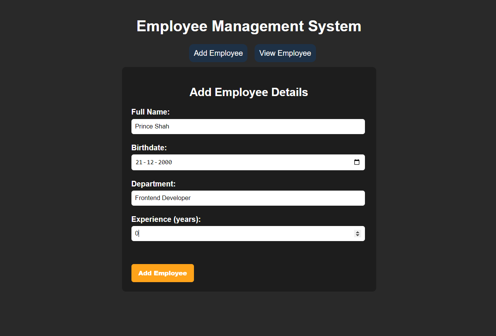

 # Employee Management System 💼

## Overview ℹ️
The Employee Management System is a web application designed to manage employee information, including adding new employees, viewing existing employees, editing employee details, and deleting employee records.

## Technologies Used 🛠️
- React ⚛️
- Redux 🔄
- React Router 🛣️
- CSS (Cascading Style Sheets) 🎨
- HTML (Hypertext Markup Language) 📄

## Components 🧩

### Navigation 🚀
- Displays links to navigate between different sections of the application.
- Allows users to add new employees and view existing employee records.

### AddEmployee 📝
- Provides a form to add a new employee to the system.
- Validates user input for full name, birthdate, department, and experience.

### EditEmployee ✏️
- Allows users to edit the details of an existing employee.
- Retrieves the employee's current information and allows for updates.

### EmployeeList 📋
- Displays a list of all employees currently stored in the system.
- Provides options to edit or delete individual employee records.

### Home 🏠
- Landing page of the application.
- Provides a brief introduction to the Employee Management System.

## CSS Styling 🎨
- Navigation styling: Custom styles for navigation links and header.
- Employee list styling: Styling for the table displaying employee records.
- Responsive design: Media queries to ensure proper layout on different screen sizes.

## How to Run ▶️
1. Clone the project repository.
2. Navigate to the project directory in your terminal.
3. Install dependencies using `npm install`.
4. Start the development server using `npm start`.
5. Access the application in your web browser at the specified address (typically http://localhost:3000).

## Future Enhancements 🚀
- Authentication and user management functionality.
- Additional validation and error handling features.
- Integration with backend server for data persistence. 
 
## License 📄
This project is licensed under the [License Name]. (Include license details if applicable)
